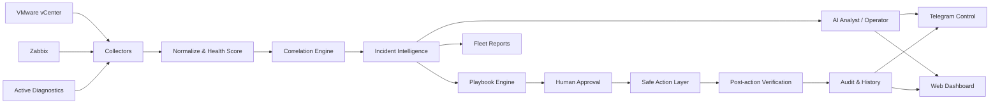

# OpsPilot AIOps — Public Showcase

**OpsPilot** is an AI-assisted, multi-site infrastructure operations platform that brings together monitoring signals from **Zabbix**, **VMware vCenter**, and active network diagnostics, then adds incident correlation, root-cause guidance, safe remediation workflows, verification, reporting, and operator-focused AI assistance.

> This repository is a **public showcase only**. The production implementation remains private and is intentionally separated from public portfolio material.

[Architecture](docs/architecture.md) · [Incident Workflow](docs/incident-workflow.md) · [AI Operator](docs/ai-operator.md) · [Security](docs/security-overview.md) · [Portfolio](docs/portfolio.md)

## Why OpsPilot?

Traditional monitoring platforms are excellent at telling operators **what changed**. OpsPilot focuses on the next operational questions:

- Why might this incident have happened?
- What evidence should be checked next?
- Is this likely a host, VM, network, service, or monitoring issue?
- Which remediation steps are safe to suggest automatically?
- Which actions require human approval?
- Did the system actually recover after the action?

## Core capabilities

- Multi-site / multi-datacenter operations
- Zabbix problem and incident integration
- VMware vCenter inventory and health collection
- Active ICMP/TCP management-plane diagnostics
- Health scoring and evidence normalization
- Incident correlation and root-cause classification
- Confidence-aware operational guidance
- Playbook generation and remediation queue
- Human-in-the-loop approval for sensitive changes
- Post-action verification and audit history
- Bilingual Telegram operator interface: Persian / English
- Web dashboard and fleet reporting
- Grounded AI incident analysis
- Free-form AI operator with bounded context
- Provider cooldown / safe degraded mode
- systemd-oriented production operation

## Architecture



See [docs/architecture.md](docs/architecture.md) for a deeper walkthrough.

## What OpsPilot is — and is not

OpsPilot **does not replace Zabbix or vCenter**. It consumes operational evidence from them and adds an intelligence/workflow layer around incident triage, correlation, remediation planning, approvals, verification, and operator interaction.

Sensitive infrastructure changes are intentionally **human-in-the-loop**. The AI layer can explain and recommend, but production-changing actions should not silently restart, reconfigure, patch, power-cycle, or delete infrastructure.

## Example incident flow

```text
Zabbix alert / vCenter signal / active diagnostic
                 ↓
        Normalize evidence
                 ↓
          Correlate incident
                 ↓
      Root-cause classification
                 ↓
        Generate safe playbook
                 ↓
   Human approval when required
                 ↓
           Execute action
                 ↓
         Verify real recovery
                 ↓
          Audit the outcome
```

## AI operator

The AI operator is designed around grounded infrastructure context rather than unrestricted autonomous control.

It can help operators:

- summarize incident evidence
- explain likely causes
- suggest verification steps
- compare evidence across monitoring sources
- answer infrastructure questions
- maintain incident context across Persian/English follow-ups

If the AI provider is unavailable or rate-limited, core monitoring, diagnostics, playbooks, reports, and deterministic incident views can continue in degraded mode.

## Technology focus

| Area | Technologies / Concepts |
|---|---|
| Monitoring | Zabbix |
| Virtualization | VMware vCenter |
| Runtime | Python, Linux |
| Storage | SQLite / WAL site isolation |
| Operations | systemd services and timers |
| Interfaces | Telegram control bot, web dashboard |
| Diagnostics | ICMP, TCP management-plane checks |
| AI | Grounded incident analysis, bounded context |
| Safety | Human approval, verification, audit trail |

## Current showcase release

**v4.1.3 — Bilingual Context Final**

Key behavior in this release line:

- Persian/English intent recognition is independent of UI language.
- Incident follow-up context can continue across languages.
- General infrastructure questions do not inherit stale incident context.
- AI provider cooldown does not disable core operations.
- Sensitive infrastructure changes remain approval-gated.

## Security separation

The public showcase does **not** include:

- production credentials
- Zabbix tokens
- vCenter credentials
- internal IP addresses or hostnames
- company topology
- production site configuration
- private logs or incidents
- production automation details that should remain internal

See [docs/security-overview.md](docs/security-overview.md).

## Portfolio summary

> Built OpsPilot, an AI-assisted infrastructure operations platform integrating Zabbix, VMware vCenter, active diagnostics, incident correlation, root-cause guidance, approval-gated remediation, post-action verification, bilingual operator workflows, and production-oriented operational controls.

See [docs/portfolio.md](docs/portfolio.md) for résumé-ready wording.

## Repository purpose

This repository demonstrates the **architecture, operational thinking, safety model, and project scope** of OpsPilot without exposing the private production implementation.