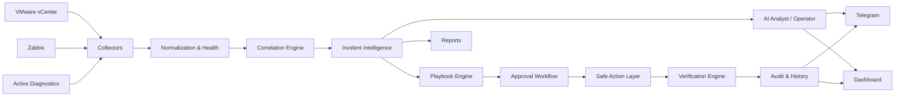

# OpsPilot Architecture

## Architectural intent

OpsPilot sits **above** monitoring and virtualization systems. It does not replace Zabbix or vCenter. It consumes their evidence and adds correlation, operator workflow, safe remediation planning, verification, reporting, and AI-assisted analysis.

## Main layers

### Collection
Collects monitoring problems, virtualization health/inventory, and active network diagnostics.

### Normalization and health scoring
Converts heterogeneous evidence into a comparable operational model.

### Correlation
Groups related signals to reduce alert fragmentation and form a more useful incident picture.

### Incident intelligence
Classifies likely failure domains and produces confidence-aware guidance.

### Playbooks and approvals
Turns incident evidence into operator steps. Sensitive changes remain approval-gated.

### Verification
Checks whether the action actually resolved the observed condition instead of assuming success.

### Audit
Preserves operator/action/outcome history for traceability.